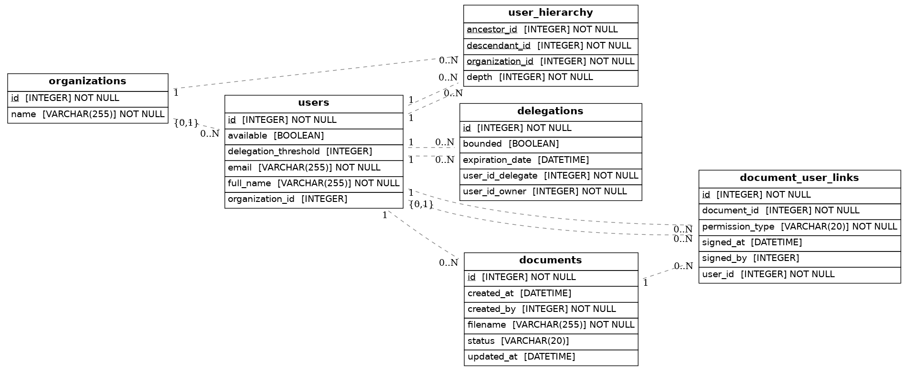

# Overview

This project is an async Python backend project providing a document management and signing system with delegation support. The system allows organizations to manage their users with hierarchical relationships defining how signature delegations can be created when a user becomes unavailable. Users can manually define delegates with an expiration period, create documents, ask people to sign them.

The main goal of the project is to make the signature process non blocking whenever a user is unavailable for a given period.

## Features

The service can be accessed through an API exposing most of the feature a user can use. It should be used following the steps below:

- An organization wants to start using the system
- A request should be sent to create an organization
- Then the initial user should create the users within its organization and create the relationships between the users
- Users can upload any document to the system and share them with other users
- Users can ask other users to sign document
- Users can list document with pending request that they can sign
- Users can create manual delegations to other users with an expiration date
- Whenever a user is unavailable, automatic delegations will be created according to the delegation depth allowed by the user
- Users can control their delegation depth and access the potential delegates if they went unavailable
- Users can sign the documents they are allowed to, either directly or through delegation

In addition to the main service, there is a cronjob checking for expired delegations to ensure they are properly deleted when needed.

The service should be enhanced with a notification system to remind users to sign documents and when a document is about to expire on the system.
An archiving system should be added to make sure documents does not stay indefinitely on the system after being signed.

## Setup

Before starting the project you should check the following sections

### Prerequisites

- Python 3.13+ (uses modern type syntax)
- MariaDB/MySQL server
- S3 bucket/MinIO

You can install a MariaDB server and a MinIO S3 bucket locally by using the supplied docker-compose.yml file.

Once you have Docker and Docker compose installed, create a directory with the supplied docker-compose.yml file and env_file renamed as .env.

Fill the environment variables as you want to and then just run:

```bash
docker compose up -d
```

### Installation

At the root project, create and enter a new virtualenv.
The install all the dependencies by running:

```bash
pip install .
```

### Startup

You should be able to start the application by running:

```bash
python -m src.project.main --host 127.0.0.1 --port 8000 --config /path/to/config
```

The config file should be either a JSON or YAML file having the following structure

```json
{
    "mariadb": {
        "user": "root",
        "password": "password",
        "host": "127.0.0.1",
        "port": 3306,
        "db_name": "app-db"
    },
    "minio": {
        "username": "admin",
        "password": "password",
        "host": "127.0.0.1",
        "port": 9000,
        "default_bucket": "app-bucket"
    }
}
```

You can access the fastAPI swagger at http://127.0.0.1:8000/docs if you used the startup command above.

## Database overview

Here is an overview of the database topology:



The database is used to store four main different entities:
- Organizations
- Users
- Documents
- Delegations

Along with these four entities, there is an association table called `DocumentUserLink`.

It is used to store the permissions a user has on a specific file, which is either `sign` or `read`. The entries with `sign` permissions can also have their `signed_at` and `signed_by` attributes filled whenever they are signed. A user can have both permissions at the same time on the same file but should not have two entries with the same (document_id, permission_type) couple.

The database also contains a closure table name `UserHierarchy` to represents each organizations hierarchy.

This table stores every relation between users, direct or indirect. If three users A, B and C have the following relationship A -> B -> C, the table will contain 6 entries:
- 3 entries with depth 0 because each user should be linked to themselves
- 2 entries with depth 1 between A -> B and B -> C
- 1 entry with depth 2 between A -> C

## Tests

The project have several basic tests [here](tests/).

To install the dependencies and then run all the tests:

```bash
pip install .[test]
pytest
```

## Routes overview

### POST /organizations

Create an organization with the given name, allowing duplicate names.
Return the data of the organization that was created.

### POST /users

Create a user within the given organization, allowing duplicate names
Return the data of the user that was created.

### PUT /users/link

Create a hierarchy link between two users. It creates all the entries in UserHierarchy table to ensure the closure table is always coherent.

### DELETE /users/unlink

Remove a hierarchy link between two users. It deletes all the links between users above the parent and users below the child in the closure table as well.

### GET /users/potential_delegates

Return the list of all users who can have a delegation from the given user if they become unavailable. It does not mean that all of them will have a delegation but only that it exists cases where they will end up having a delegation.

### PUT /users/{user_id}/delegation_threshold

Set the maximum depth allowed for automated delegation creation if the user becomes unavailable. A delegation automatically created is a bounded delegation.

### PUT /users/{user_id}/availability

Set the given user availability.

If the user becomes unavailable, it will:
- Determine if the user already have delegated its signature rights
- If no it will search for the closest delegated user and create a delegation that will live until the user come back
- If the user had a delegation from a user above, it will create a delegation from this user above to a user below, as long as the delegation threshold for the above user is respected.

If the user becomes available, it will:
- Revoke all bounded delegations this user gave during his absence
- Revoke all bounded delegations that were created from a user above to a user below and only keep the delegation from the above user to the current user

### PUT /delegation/create

Create a manual delegation with an expiration date. Manual delegations can only be revoked by the user or by expiring. Thery are not affected by the availability status of any user.

### GET /delegations

List all the active delegations from a given user, both manual and bounded.

### DELETE /delegations/revoke

Revoke the delegation previously given by a user to another one.

### POST /documents/create

Upload the given file to the file system and creates a metadata entry in the Document table as well as a 'read' entry in the DocumentUserLinks table. When created a document has the 'inert' status meaning it does not need any signature

### POST /documents/{document_id}/share

Create a 'read' entry in the DocumentUserLink for each user the document has been shared with.

### POST /documents/{document_id}/request_signature

Create a 'sign' entry in the DocumentUserLink for the specified signing user

### GET /documents/pending

List all the documents waiting to be signed by the user.
It lists the documents needing a direct signature and documents the user is allowed to sign via delegation.

### POST /documents/{document_id}/sign

Check if the user has the right to sign the document and then update the DocumentUserLink entry to be marked as signed by the user. Then if there is no remaining unsigned entries in DocumentUserLink for this document, the document is tagged as signed.